# Lab 8 : Audit de Sécurité Statique Mobile (BeVigil & Yaazhini)

Ce dépôt héberge l'intégralité du livrable pour le **Lab 8** de Sécurité Mobile. Ce laboratoire est axé sur la réalisation d'un audit de sécurité statique complet (externe et interne) d'une application Android pédagogique intégrant du code natif C++ compilé (pont JNI).

---

## 📱 Cible d'Analyse
- **Nom de l'application** : JNIDemo Basics
- **Identifiant de package** : `com.example.jnidemo`
- **Fichier analysé** : `app-debug.apk`
- **Empreinte SHA-256** : `18759D08E3D2292B1390AF798C6D204EFAFEA4073229B48C46F840AA48345A92`
- **Environnement d'exécution de l'audit** : Windows 10 Pro

---

## 📂 Structure du Workspace
Le workspace respecte l'arborescence standardisée requise pour un audit professionnel :
```
lab-mobile-security/
├── 00-scope/           # Périmètre éthique et légal + Cible (APK ignoré dans Git)
├── 01-bevigil/         # Notes BeVigil (externe) + Télémétrie JSON
├── 02-yaazhini/        # Notes Yaazhini (interne) + Rapport HTML
├── 03-triage/          # Normalisation triage CSV (10 constats) + Mapping OWASP MASVS
├── 04-report/          # Rapport d'analyse final complet structuré
└── checklist_fin.md    # Liste de conformité finale (signée)
```

---

## 🛠️ Étapes Réalisées & Captures Écran

### Task 0 & 1 : Cadrage légal et Traçabilité
Définition stricte des limites d'intervention dans [scope.md](00-scope/scope.md) et initialisation des fichiers de suivi [analyse_info.txt](analyse_info.txt) et [commands.log](commands.log).

### Task 2 : Analyse de l'Artefact
Calcul de l'empreinte numérique SHA-256 de l'APK cible pour garantir son intégrité et sa traçabilité durant tout le cycle d'audit.

### Task 3 & 4 : Analyse Statique Externe avec BeVigil
Recherche de fuites d'informations et d'expositions depuis l'extérieur de l'application (sous-domaines, endpoints, bibliothèques exposées public).
- *Visualisation de la surface externe et détection d'endpoints :*
  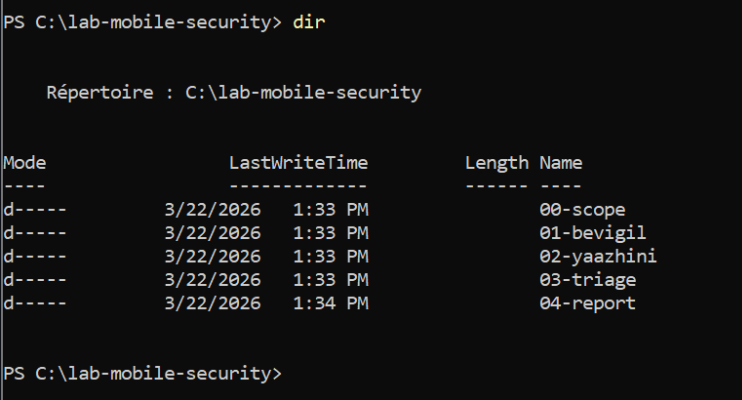
  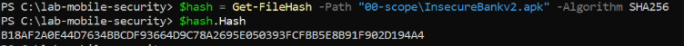
  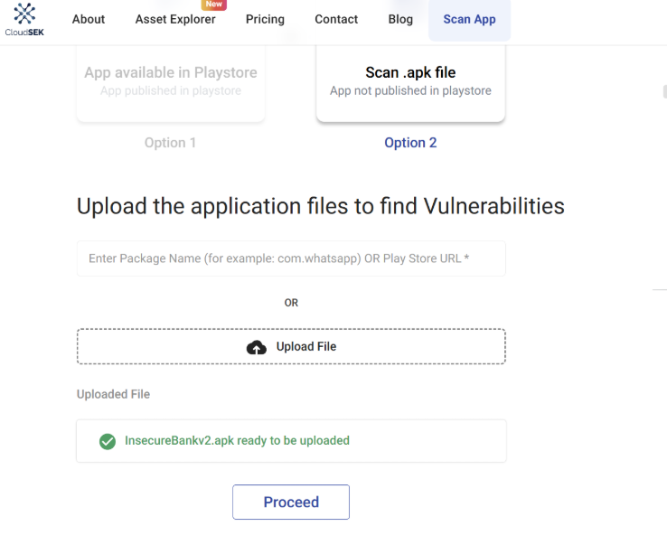
  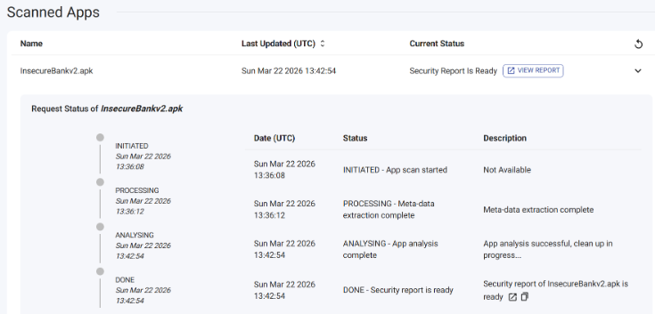
  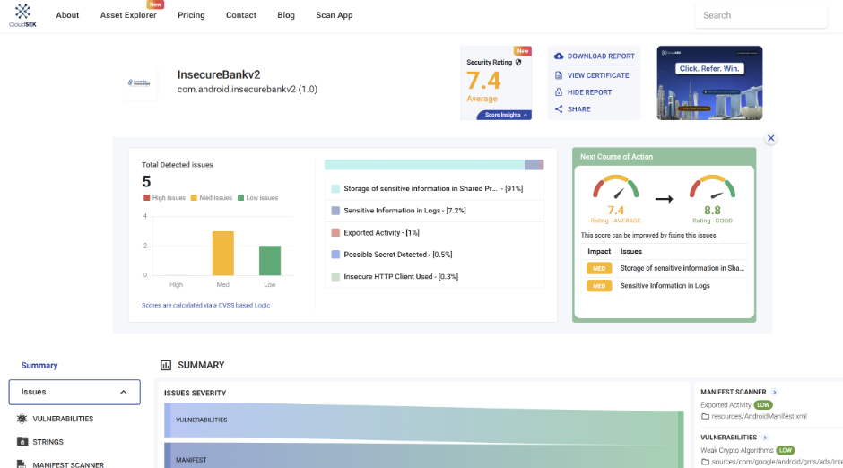

### Task 5 & 6 : Analyse Statique Interne avec Yaazhini & Python Inspection
Désassemblage du bytecode DEX de l'APK et analyse du manifeste ainsi que de la bibliothèque native compilée `libnative-lib.so`.
- *Analyse statique approfondie des configurations et du code natif :*
  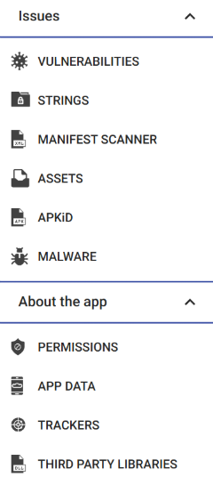
  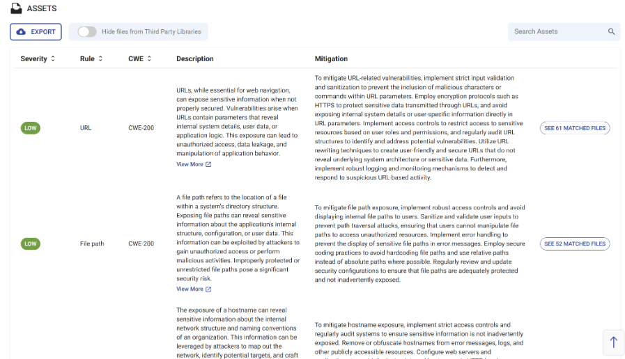
  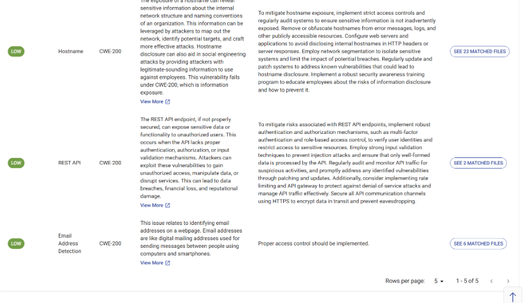
  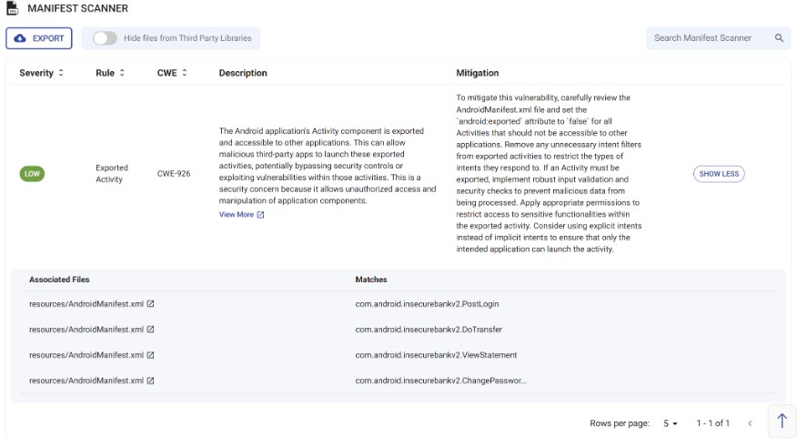
  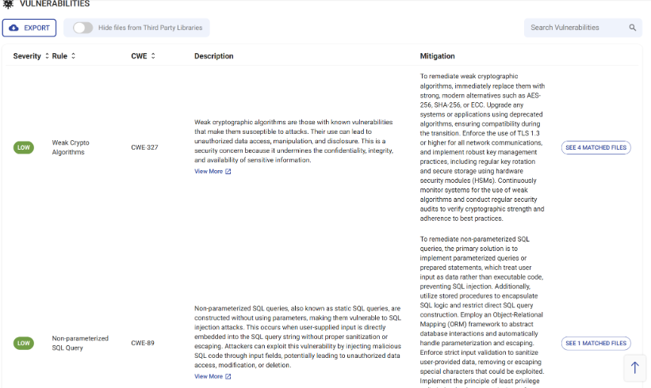
  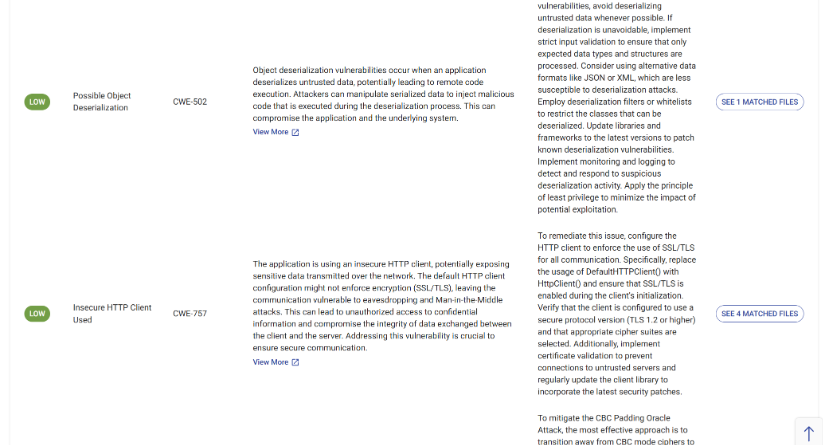
  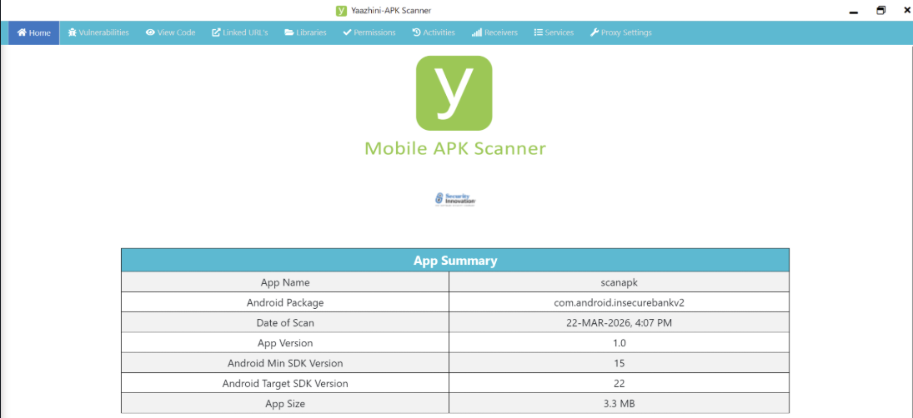
  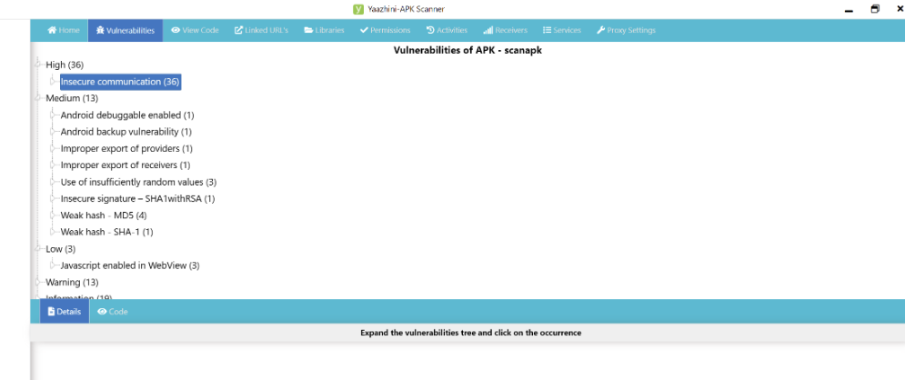
  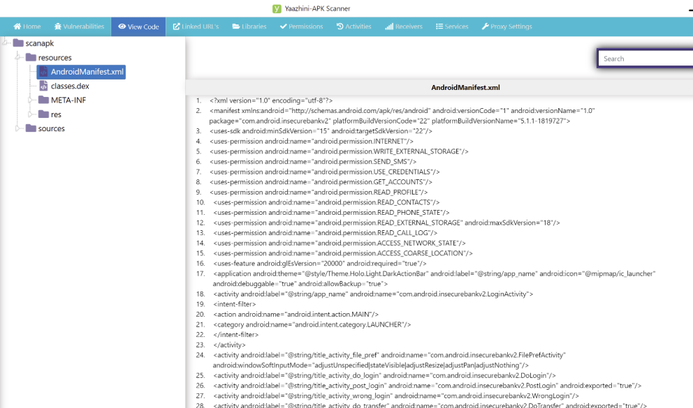
  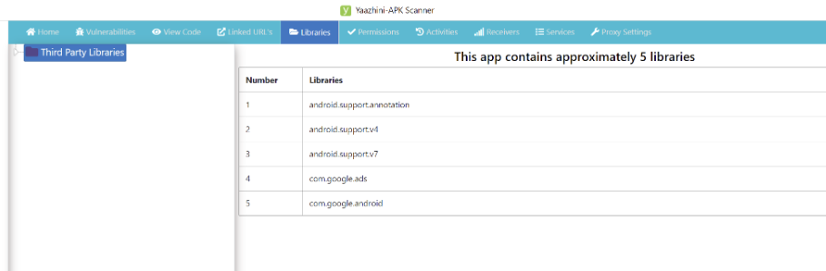

### Task 7 & 8 : Triage et Corrélation OWASP MASVS
Normalisation de 10 vulnérabilités clés identifiées dans le fichier [triage.csv](03-triage/triage.csv) et corrélation technique avec justifications dans [owasp_mapping.md](03-triage/owasp_mapping.md).
- *Gestion des vulnérabilités et alignement avec le standard OWASP MASVS :*
  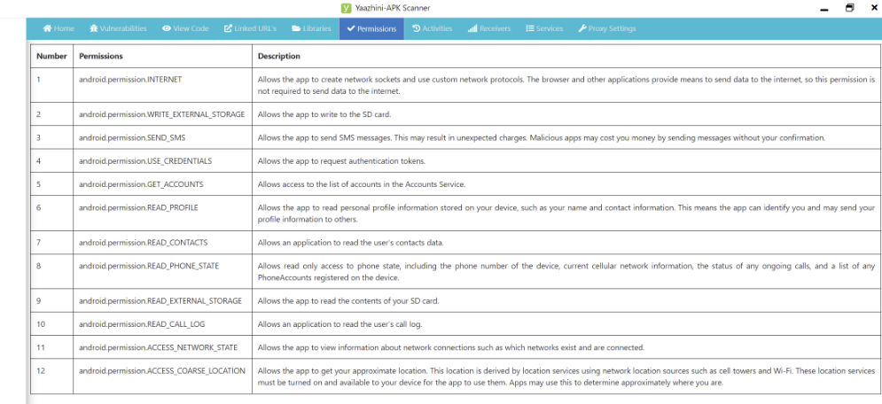
  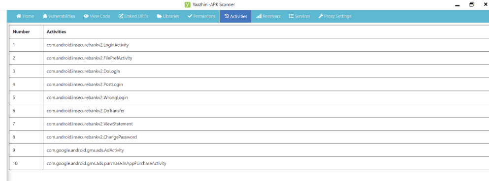
  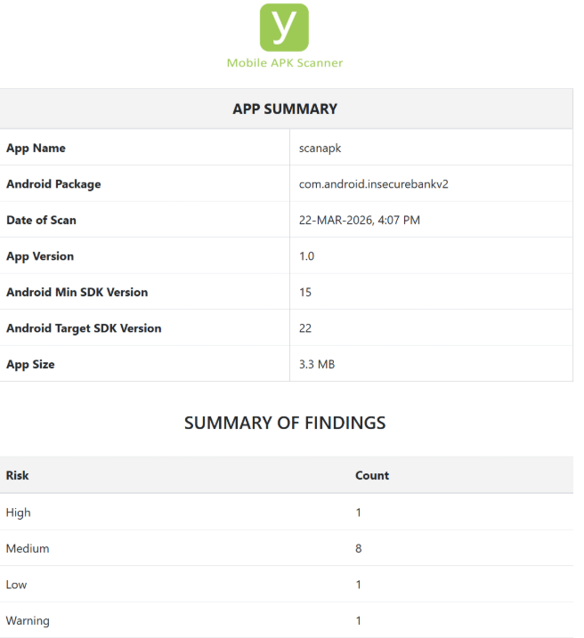

### Task 9 & 10 : Rapport Final et Clôture
Synthèse décisionnelle et technique complète dans [rapport_final.md](04-report/rapport_final.md) et signature éthique dans [checklist_fin.md](checklist_fin.md).
- *Validation finale et clôture professionnelle :*
  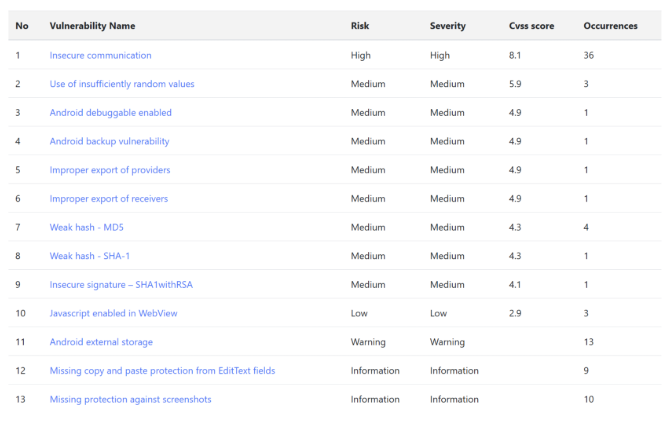

---

## 🔒 Résumé des Constatations Majeures
1. **Mode Débogage Actif (High / MASVS-CODE-2)** : L'APK est marqué `debuggable="true"`, permettant l'injection de code dynamique en mémoire à chaud.
2. **Sauvegarde Globale Autorisée (Medium / MASVS-STORAGE-4)** : L'application permet la sauvegarde complète de son répertoire privé via `adb backup`.
3. **Privilèges DUMP Système (Medium / MASVS-PLATFORM-1)** : L'application sollicite inutilement la permission système privilégiée `DUMP`.
4. **Secrets Codés en Dur (Medium / MASVS-STORAGE-1)** : La constante textuelle `"Hello from C++ via JNI !"` est exposée en clair dans la section `.rodata` de la bibliothèque native `libnative-lib.so`.
5. **Absence d'Obfuscation Native (Low / MASVS-RESILIENCE-1)** : Les méthodes et signatures JNI ne sont pas stripées et sont décompilables en texte clair par des outils comme Ghidra ou IDA.

---

*Mahmoud Laasri - Analyste Sécurité Mobile*
